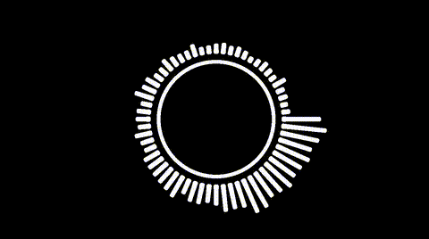
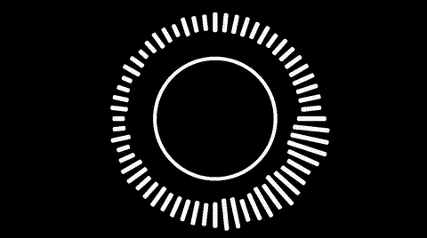
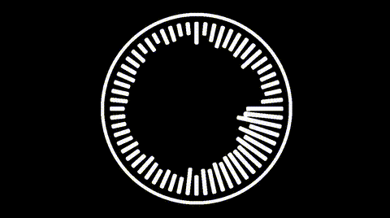
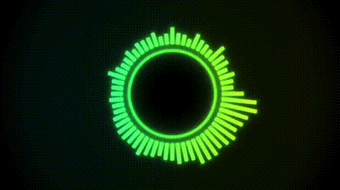

**Projeto 2 – Shaders**

**Data de entrega:** 15/10/2025, via Blackboard.

**Link:** enviar via Blackboard o link do Shadertoy.

**Entrega:** individual.

Nesse projeto, você irá implementar desenhos diretamente por shaders. Para essa projeto você irá desenhar com recursos do Fragment Shader em GLSL no ShaderToy. Siga as imagens de referência.

## Estrutura do Projeto

O projeto tem somente uma parte. Você poderá desenvolver seu código diretamente na ferramenta do Shadertoy ([https://www.shadertoy.com/](https://www.shadertoy.com/)) para isso confirme que você conseguiu salvar seu projeto e que outros possam ver. 
Recomendamos o uso [Shadertoy Custom Texures Chrome extension](https://chromewebstore.google.com/detail/shadertoy-custom-texures/jgeibpcndpjboeebilehgbpkopkgkjda) para testar o projeto com sua musica favorita.

* **Tarefa 1:** criar a animação base (C)
 
 
 

* **Tarefa 2:** melhorar a animação (C+ até A+)
 

## Rubrica

_C_

- Circunferência reagindo a música (FFT ou amplitude global);
- Retângulos em volta, reagindo a musica (devem ser posicionados seguindo a curva da circunferência (Obrigatório reagir ao FFT). Cada retângulo deve reagir à um canal do áudio;

_C+_

- Qualquer tipo de aleatoriedade:
- Grossura dos retângulos;
- Cores;
- Alterar resposta da frequência da musica;
- Efeito de background;
- Glow/Neon (necessário utilizar uma SDF 2D de retângulo);
- Controle de cores;

 
_Adiciona meio conceito_

- Adicionar outro efeito como starfield / Warp drive effect;
- Efeito de câmera shake ou qualquer tipo de UV displacement;
- Adicionar outra forma geométrica que reage a música;
- Tratar a entrada de áudio: Suavizar a entrada, aplicar algum filtro de audio;
- Criação de paletas diferentes proceduralmente: [https://iquilezles.org/articles/palettes/](https://iquilezles.org/articles/palettes/);

## Orientações

Links do código da aula e outros:

- Documentação GLSL: [https://docs.gl/sl4/all](https://docs.gl/sl4/all)
- Exemplo da Aula: [https://www.shadertoy.com/view/WcfcDf](https://www.shadertoy.com/view/WcfcDf)
- Exemplo com Áudio: [https://www.shadertoy.com/view/Xds3Rr](https://www.shadertoy.com/view/Xds3Rr)

## Entrega

Para entregar o projeto use o Shadetoy. Deixe seu código minimamente documentado e garanta que ele está rodando corretamente. Se quiser deixar o código fechado, não esqueça de dar acesso para o professor ao repositório.

## Honestidade acadêmica

As tarefas devem ser concluídas individualmente. Você está convidado a discutir as várias partes das tarefas com seus colegas, mas você deve implementar os algoritmos. Você não deve ficar olhando o código de seus colegas.
