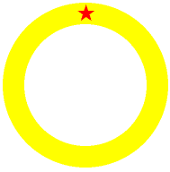

**Projeto 2 – Shaders : 1ª parte**

**Data de entrega:** 9/5/2023, via Blackboard.

**Link do Github:** enviar via Blackboard o link do Shadertoy ou do github.

**Entrega:** individual.

Nesse projeto, você irá implementar desenhos diretamente por shaders. Para essa primeira parte você irá desenhar com recursos do Fragment Shader em GLSL. Faça uma animação 2D no Fragment Shader de uma estrela (qualquer tipo) sobre um anel. A volta toda deve demorar 5 segundos. A velocidade na parte superior deve ser zero.


## Estrutura do Projeto

O projeto tem somente uma parte. Você poderá desenvolver seu código diretamente na ferramenta do Shadertoy ([https://www.shadertoy.com/](https://www.shadertoy.com/)) para isso confirme que você conseguiu salvar seu projeto e que outros possam ver, outra opção é criar direto uma aplicação em OpenGL e chamar o Fragmente Shader, para isso você poderá usar o código de referência em OpenGl da disciplina para acesso a Shaders em: [https://github.com/lpsoares/RenderizadorOpenGL](https://github.com/lpsoares/RenderizadorOpenGL).

* **Tarefa 1:** criar a animação (10 pontos)



## Código Base

Você poderar desenvolver no [ShaderToy](https://www.shadertoy.com/), contudo se desejar pode usar um código base para o projeto em: [https://github.com/lpsoares/RenderizadorOpenGL](https://github.com/lpsoares/RenderizadorOpenGL). Junto com o código existem uma série de exemplos que você poderá usar para montar o seu código.

Esse código está em desenvolvimento, assim, caso o professor oriente atualizar o seu fork, faça os seguintes passos:

```
git remote add upstream https://github.com/lpsoares/RenderizadorOpenGL
git pull upstream master
```

Cuidado para não comprometer seus dados, para atualizar seus dados vocês pode precisar de algo como:

```
git push origin master --force
```

## Instruções

O código final deve usar recursos como `iTime` e `iResolution` do Shadertoy. Sem isso você não conseguirá rodar sua animação.


## Entrega

Para entregar o projeto use o Shadetoy ou o Github. Deixe seu código minimamente documentado e garanta que ele está rodando corretamente. Se quiser deixar o código fechado, não esqueça de dar acesso para o professor ao repositório.


## Honestidade acadêmica

As tarefas devem ser concluídas em dupla ou individualmente. Você está convidado a discutir as várias partes das tarefas com seus colegas, mas você deve implementar os algoritmos. Você não deve ficar olhando o código de seus colegas.
